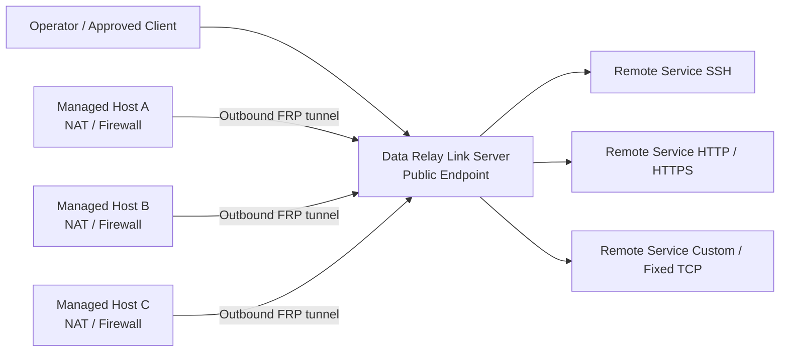

<h1 align="center">Data Relay Link</h1>

<p align="center">
  <strong>격리·제한 네트워크를 위한 Secure Connectivity.</strong>
</p>

<p align="center">
  네트워크 전체를 연결하지 않고 실제로 필요한 연결만 Relay합니다.
</p>

<p align="center">
  <a href="README.md">English</a> · <strong>한국어</strong> · <a href="https://link.datarelay.run/">제품 웹사이트</a>
</p>

<p align="center">
  
  
  
  
  
</p>

<p align="center">
  <strong>제품 웹사이트:</strong> <a href="https://link.datarelay.run/">link.datarelay.run</a>
</p>

---

> **라이선스 — Source Available:** Data Relay Link는 개인 사용 및 조직 내부 상업 운영에 무료입니다. 내부 소스 수정은 허용됩니다. 재판매, 상업적 재배포, OEM/화이트라벨, 경쟁·파생 상업 제품, SaaS/호스팅/관리형 서비스 제공에는 별도의 서면 commercial license가 필요합니다. 자세한 내용은 [LICENSE](LICENSE)와 [LICENSING.md](LICENSING.md)를 참고하십시오.

## Data Relay Link란

Data Relay Link는 공식 pinned [`fatedier/frp`](https://github.com/fatedier/frp)를 기반으로 한 lightweight, CLI-first secure connectivity layer입니다.

NAT, Firewall, 제한 네트워크 뒤의 시스템이 사용자가 관리하는 Server로 outbound 연결을 만들고, 의도적으로 승인한 서비스와 접근 경로만 Relay합니다.

핵심 원칙:

> **네트워크 전체를 연결하지 마십시오. 실제로 필요한 연결만 Relay하십시오.**

Full VPN, network overlay, RMM platform, custom FRP fork를 구축하는 복잡성을 피하는 것이 목적입니다.

## 세 가지 연결 / 접근 plane

```text
Remote Access     outside → approved internal Remote Service
Internet Access   managed/protected source → approved outside destination
AI Access         authenticated AI Identity → approved target permissions
```

## 현재 v2.4 public model

```text
Managed Host / DRLink Agent

Network Object / Network Group
Service Object / Service Group
Permission Object / Permission Group

AI Identity
Remote Service

Remote Access
Internet Access
AI Access

BLACKLIST / WHITELIST

ConfigurationBundle
```

초기 정책 상태는 No Policy / No Rules이며 실효 접근은 ALLOW입니다.
정책이 생성되면 BLACKLIST는 일치하는 enabled Rule을 deny하고,
WHITELIST는 일치하는 enabled Rule을 allow합니다. Rule은 순서가 없으며
Rule별 ALLOW/DENY action을 갖지 않습니다. Policy Rule은 접근을 허용하거나
거부할 뿐, connectivity 자체를 만들지 않습니다.

## Architecture 요약



```text
                    Data Relay Link
                          │
           Embedded SQLite control plane
                  /var/lib/drlink/drlink.db
                          │
          ┌───────────────┼───────────────┐
          ▼               ▼               ▼
   Remote Access    Internet Access      AI Access
   inbound relay    controlled egress    MCP Bridge
```

외부 database 서비스는 필요하지 않습니다. Server는 Linux 기반입니다. macOS와 Windows는 검증된 platform matrix에 따라 Agent Host로 지원됩니다.

Docker Server 배포는 v2.4 target에 포함되지 않으며 이후 release line roadmap 항목입니다.

## 주요 기능

| 기능 | 제공하는 것 |
|---|---|
| **Zero-Touch enrollment** | Short-lived enrollment credential로 빠른 Managed Host 온보딩 |
| **Stable identity** | Immutable Managed Host identity와 persistent Remote Service identity |
| **Stable endpoint** | 정상 lifecycle에서 public-port reservation 유지 |
| **Remote Services** | Agent 소유의 TCP / Fixed TCP connectivity (UDP Remote Service는 거부) |
| **LAN reachability** | 로컬 Managed Host 또는 도달 가능한 internal-LAN host에 publish |
| **Access Policy** | Remote / Internet / AI Access에 대한 BLACKLIST / WHITELIST |
| **AI Access / MCP** | Verified AI Identity → Permission을 통한 MCP Bridge 접근 |
| **ConfigurationBundle** | Server/Agent 원자성 범위의 multi-resource 변경 세트 |
| **Health & operations** | Doctor, support bundle, lifecycle, backup/restore |
| **단일 운영 인터페이스** | 일반 운영은 `sudo drlink` |

## Server vs Agent Host CLI context

기본 운영 인터페이스:

```bash
sudo drlink
```

| Context | 소유 범위 |
|---|---|
| **Server** | Managed Hosts, Network/Service/Permission Object·Group, Access Policy, Internet Access, AI Access / AI Identity, Server ConfigurationBundle |
| **Agent Host** | 해당 Agent의 local lifecycle과 소유 Remote Service, Agent ConfigurationBundle |

Remote Service mutation은 소유 Agent Host에서만 수행됩니다. Server의 Remote Service 설정 조회는 read-only입니다. destination이 다른 host이면 현재 Agent Host가 Relay Host가 됩니다.

## 안전한 빠른 시작 / discovery

immutable `v2.4.0` 태그가 생기기 전에는 exact SHA 또는 owner가 지정한 candidate artifact로만 설치하십시오. `v2.4.0/dist/bootstrap-server.sh` 형태의 태그 URL은 태그가 생성되기 전까지 404입니다.

설치 후 상태를 바꾸지 않는 discovery 명령을 우선 사용하십시오:

```bash
sudo drlink show version
sudo drlink show status
sudo drlink system diagnostics
```

Data Relay Link는 외부 firewall/NAT, cloud security group, DNS provider record, SSH account, application certificate를 자동으로 변경하지 않습니다.

## Zero-Touch enrollment

Server에서 현재 vocabulary로 enrollment를 발급합니다:

```text
set enrollment zero-touch
```

(또는 Guided menu → Managed Hosts → Connect a Managed Host)

운영자용 설치 명령은 private-CA fingerprint 검증과 one-time ticket 의미를 유지하는 짧은 HTTPS launcher입니다.

Managed Host가 enroll되고 Remote Service가 enabled되면 예약된 public endpoint로 연결합니다:

```text
ssh -p <public-port> <username>@<public-hostname>
```

SSH 연결 예시의 username은 hint metadata일 뿐입니다. 검증된 local account를 쓰거나 `<username>`을 표시하십시오. **기본 username은 없습니다.**

Zero-Touch는 다음을 하지 **않습니다**:

- 네트워크 전체 연결
- enrollment 인증 생략
- OS 사용자 생성, 비밀번호 설정, SSH Server 설치, `sshd_config` 변경

## Remote Service lifecycle

Remote Service는 Agent Host가 소유하는 실제 connectivity입니다:

```text
Agent Host
+ single destination
+ one Service Object
→ Remote Service
→ stable DRLink endpoint
```

Remote Service는 TCP와 Fixed TCP Service Object만 지원합니다. UDP Remote Service는 지원되지 않습니다.

실효 inbound access 조건:

```text
Enabled Remote Service
+
Reachable connector/target
+
Remote Access policy permits the flow
(or no policy is configured)
```

정상 lifecycle은 identity와 public-port reservation을 보존하도록 설계되어 있습니다. disable/enable, revoke, uninstall, release는 서로 다른 의미입니다. 정확한 matrix는 Product Master와 CLI/AI Master를 참고하십시오.

## Internet Access와 AI Access

### Internet Access

보호된 host는 표준 HTTP/HTTPS proxy 설정을 사용할 수 있습니다. gateway는 명시적으로 승인된 destination/protocol/port만 허용합니다.

보안에는 다음이 포함됩니다:

```text
BLACKLIST / WHITELIST policy enforcement
fail-closed unsafe-destination checks
server-side DNS
DNS rebinding resistance
SSRF/private/local/metadata protection
safe CONNECT/SNI behavior
explicit public Host/CIDR policy where supported
Fixed TCP through the same authority
```

기술 능력명: **Controlled Egress**. 일반 CLI/resource 이름: **Internet Access**.

### AI Access / MCP

MCP Bridge는 v2.4.0 **target**에 포함되며, stable release 전에 qualification이 필요합니다. 이미 출시된 stable 기능으로 설명하지 마십시오.

```text
AI Host / tool
   │
 MCP over HTTPS
   │
Data Relay Link Server MCP Bridge
   │
AI Access policy
   │
existing authenticated DRLink control path
   │
Managed Host / private target
```

AI Access의 source는 검증된 **AI Identity**입니다. Permission Object / Permission Group으로 capability와 path 권한을 부여합니다. MCP는 별도 public identity model이 아니라 integration layer입니다.

## ConfigurationBundle / AI-assisted configuration

독립적인 단일 resource에는 direct CLI를 사용하십시오.

서로 의존하는 여러 resource에는 ConfigurationBundle을 사용하십시오. Human Wizard, AI one-shot CLI, ConfigurationBundle은 하나의 Change Plan / mutation engine을 공유합니다.

원자성 범위는 현재 CLI context입니다:

```text
Server ConfigurationBundle  → Server에서 atomic
Agent ConfigurationBundle   → 해당 Agent Host에서 atomic
```

Server+multi-Agent를 아우르는 단일 분산 transaction은 없습니다. Bundle에서 생략은 변경 없음, `state: absent`는 명시적 삭제/reset입니다.

## Release / development 상태

```text
PROJECT_VERSION=2.4.0
RELEASE_CHANNEL=development
FRP_VERSION=0.71.0
```

현재 project version: **2.4.0**<br>
현재 pinned FRP version: **v0.71.0**

이 저장소 트리는 branch
[`feature/v2.4.0-final-product-closure`](https://github.com/datarelay-labs/datarelay-link/tree/feature/v2.4.0-final-product-closure)
위의 **v2.4.0 development target**입니다. exact-HEAD qualification이 끝나기 전에는 stable `v2.4.0` 태그가 없습니다. repository metadata가 실제로 해당 channel로 바뀌지 않는 한 이 branch를 stable, RC, preview로 취급하지 마십시오.

Version policy는 다음을 구분합니다:

```text
Documented stable baseline     v2.3.0
Older published release        v2.2.1
Not manufactured               v2.3.1
Current development target     2.4.0 / development channel
```

역사적 태그만으로 현재 stable 지위를 발명하지 마십시오.

태그 전 installer/bootstrap은 존재하지 않는 미래 stable 태그가 아니라 immutable exact SHA 또는 immutable candidate artifact를 사용해야 합니다. 태그 후 의도된 형태:

```text
.../datarelay-labs/datarelay-link/v2.4.0/dist/bootstrap-server.sh
```

이 경로는 immutable 태그가 생기기 전까지 404입니다.

Repository: [`datarelay-labs/datarelay-link`](https://github.com/datarelay-labs/datarelay-link)

가변 `main`은 정상 설치/업데이트 경로가 아닙니다. 개발 및 사전 릴리즈 검증은 exact immutable source SHA 또는 명시적으로 qualification 된 candidate artifact를 사용합니다.

구 updater의 legacy client는 one-time verified compatibility bridge가 필요할 수 있지만, 이 호환 경로가 현재 immutable-source update policy를 대체하지 않습니다.

Stable release는 동일 final exact HEAD에서 세 access plane과 해당 lifecycle/platform gate를 포함한 Real E2E 2회 통과가 필요합니다. code/dependency 변경 시 pass counter가 초기화됩니다.

## 문서

공개 문서: https://link.datarelay.run

시작 지점:

- [`docs/DOCUMENTATION_INDEX.md`](docs/DOCUMENTATION_INDEX.md) — 문서 권위/상태 인덱스
- [`docs/PRODUCT_MASTER.md`](docs/PRODUCT_MASTER.md) — 제품 수준 결정
- [`docs/DATA_RELAY_LINK_CLI_AI_MASTER_v2.4_FINAL.md`](docs/DATA_RELAY_LINK_CLI_AI_MASTER_v2.4_FINAL.md) — CLI/AI SSOT
- [`docs/CLI_REFERENCE.md`](docs/CLI_REFERENCE.md) — target direct grammar
- [`docs/Data Relay Link CLI Information Architecture.md`](docs/Data%20Relay%20Link%20CLI%20Information%20Architecture.md) — CLI UX
- [`docs/CONFIGURATION_BUNDLE.md`](docs/CONFIGURATION_BUNDLE.md) — declarative / AI copy-paste contract
- [`docs/INSTALLATION.md`](docs/INSTALLATION.md) — Server/Agent 설치 및 enrollment
- [`docs/UPGRADE.md`](docs/UPGRADE.md) — 업그레이드 채널, migration, rollback
- [`docs/REMOTE_ACCESS.md`](docs/REMOTE_ACCESS.md) — Remote Service와 Remote Access 운영
- [`docs/AI_ACCESS_MCP.md`](docs/AI_ACCESS_MCP.md) — AI Identity, permission, AI Access, MCP
- [`docs/TROUBLESHOOTING.md`](docs/TROUBLESHOOTING.md) — 진단 및 복구 가이드
- [`docs/CONTROLLED_EGRESS.md`](docs/CONTROLLED_EGRESS.md) — Internet Access 동작
- [`docs/SECURITY.md`](docs/SECURITY.md) — 보안 경계
- [`docs/VERSION_POLICY.md`](docs/VERSION_POLICY.md) — version/release 규칙
- [`docs/RELEASE_CHECKLIST.md`](docs/RELEASE_CHECKLIST.md) — final stable gate
- [`docs/CONTROL_PLANE_ARCHITECTURE.md`](docs/CONTROL_PLANE_ARCHITECTURE.md) — 내부 architecture/history

## Non-goals

v2.4.0은 다음을 요구하지 않습니다:

```text
Web UI
Docker Server deployment
external database server
central SaaS control plane
HA database cluster
hundreds/thousands-host orchestration
VPN / full network overlay
SASE / SWG / CASB / DLP
TLS inspection
automatic firewall / DNS management
```

## Source Available license

**Data Relay Link는 source available이며 open source가 아닙니다.**

통제 조건과 쉬운 요약은 [LICENSE](LICENSE)와 [LICENSING.md](LICENSING.md)를 참고하십시오.
