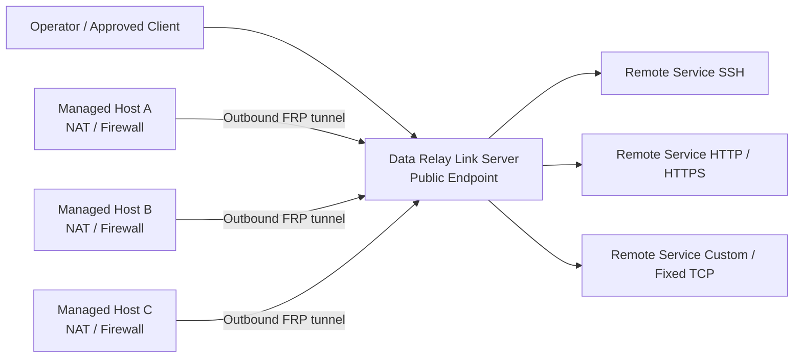

<h1 align="center">Data Relay Link</h1>

<p align="center">
  <strong>Secure Connectivity for Isolated Networks.</strong>
</p>

<p align="center">
  Relay only the connections that are actually needed instead of joining entire networks.
</p>

<p align="center">
  <strong>English</strong> · <a href="README.ko.md">한국어</a> · <a href="https://link.datarelay.run/">Product Website</a>
</p>

<p align="center">
  
  
  
  
  
</p>

<p align="center">
  <strong>Product website:</strong> <a href="https://link.datarelay.run/">link.datarelay.run</a>
</p>

---

> **User E2E qualification:** [USER_E2E_SCENARIOS.md](USER_E2E_SCENARIOS.md) — canonical FULL_USER_E2E execution matrix (role, security, and performance scenarios) plus the v2.4 operator manual runbook.

> **License — Source Available:** Data Relay Link is free for personal use and for an organization's own internal commercial operations. Internal source modifications are allowed. Resale, commercial redistribution, OEM/white-label use, competing or derivative commercial products, and SaaS/hosted/managed-service offerings require a separate written commercial license. See [LICENSE](LICENSE) and [LICENSING.md](LICENSING.md).

## What Data Relay Link is

Data Relay Link is a lightweight, CLI-first secure connectivity layer built on the official pinned [`fatedier/frp`](https://github.com/fatedier/frp).

Systems behind NAT, firewalls, and restricted networks initiate outbound connectivity to a Server you control. Data Relay Link then relays only the specific services and access paths you intentionally authorize.

Core principle:

> **Do not connect entire networks. Relay only the connections that are actually needed.**

It is designed to avoid the operational overhead of a full VPN, network overlay, RMM platform, or custom FRP fork.

## Three connectivity / access planes

```text
Remote Access     outside → approved internal Remote Service
Internet Access   managed/protected source → approved outside destination
AI Access         authenticated AI Identity → approved target permissions
```

## Current v2.4 public model

```text
Managed Host / DRLink Agent

Network Object / Network Group
Service Object / Service Group
Permission Object / Permission Group

AI Identity
Remote Service

Remote Access
Internet Access
AI Access

BLACKLIST / WHITELIST

ConfigurationBundle
```

Initial policy state is No Policy / No Rules with effective access ALLOW.
When a policy is created, BLACKLIST means matching enabled Rules deny and
WHITELIST means matching enabled Rules allow. Rules are not ordered and do not
carry per-rule ALLOW/DENY actions. A policy Rule authorizes or denies access;
it never creates connectivity.

## Architecture summary



```text
                    Data Relay Link
                          │
           Embedded SQLite control plane
                  /var/lib/drlink/drlink.db
                          │
          ┌───────────────┼───────────────┐
          ▼               ▼               ▼
   Remote Access    Internet Access      AI Access
   inbound relay    controlled egress    MCP Bridge
```

No external database service is required. The Server remains Linux-based. macOS and Windows are supported Agent Host platforms according to the validated platform matrix.

Docker Server deployment is not part of the v2.4 target; it is roadmap work for a later release line.

## Key capabilities

| Capability | What Data Relay Link provides |
|---|---|
| **Zero-Touch enrollment** | Fast Managed Host onboarding with short-lived enrollment credentials |
| **Stable identity** | Immutable Managed Host identity and persistent Remote Service identity |
| **Stable endpoints** | Public-port reservations preserved across normal lifecycle operations |
| **Remote Services** | Agent-owned TCP and Fixed TCP connectivity (UDP Remote Service is rejected) |
| **LAN reachability** | Publish on the local Managed Host or another reachable internal-LAN host |
| **Access Policy** | BLACKLIST / WHITELIST for Remote, Internet, and AI Access |
| **AI Access / MCP** | Verified AI Identity → approved target permissions via MCP Bridge |
| **ConfigurationBundle** | Multi-resource AI/operator change sets with Server/Agent atomicity |
| **Health & operations** | Doctor, support bundles, lifecycle commands, backup/restore |
| **Single operator interface** | `sudo drlink` for normal management |

## Server vs Agent Host CLI contexts

Primary operator interface:

```bash
sudo drlink
```

| Context | Owns |
|---|---|
| **Server** | Managed Hosts, Network/Service/Permission Objects and Groups, Access Policies, Internet Access, AI Access / AI Identity, Server ConfigurationBundle |
| **Agent Host** | Local Agent lifecycle and Remote Services owned by that Agent Host, Agent ConfigurationBundle |

Remote Service mutation is local to the Agent Host that owns it. Server inspection of Remote Service configuration is read-only. When a Remote Service destination is another host, the current Agent Host is the Relay Host.

## Safe quick start / discovery

Until an immutable `v2.4.0` tag exists, install only from an exact SHA or owner-directed candidate artifact. A future-looking tag URL such as `v2.4.0/dist/bootstrap-server.sh` would 404 until that tag is created.

After install, prefer discovery commands that do not mutate state:

```bash
sudo drlink show version
sudo drlink show status
sudo drlink system diagnostics
```

Data Relay Link does **not** automatically modify external firewall/NAT rules, cloud security groups, DNS-provider records, SSH accounts, or application certificates.

## Zero-Touch enrollment

On the Server, issue enrollment through current vocabulary:

```text
set enrollment zero-touch
```

(or Guided menu → Managed Hosts → Connect a Managed Host)

The operator-facing install command is a short HTTPS launcher that preserves private-CA fingerprint verification and one-time ticket semantics inside the maintained bootstrap artifact.

After a Managed Host enrolls and a Remote Service is enabled, operators connect with the reserved public endpoint:

```text
ssh -p <public-port> <username>@<public-hostname>
```

SSH connection-example usernames are optional hint metadata only. Prefer a verified local account, or show `<username>`. There is **no default username**.

Zero-Touch does **not**:

- join entire networks
- skip enrollment authentication
- create OS users, set passwords, install SSH servers, or rewrite `sshd_config`

## Remote Service lifecycle

A Remote Service represents real connectivity owned by an Agent Host:

```text
Agent Host
+ single destination
+ one Service Object
→ Remote Service
→ stable DRLink endpoint
```

Remote Service supports TCP and Fixed TCP Service Objects. UDP Remote Service is not supported.

Effective inbound access requires:

```text
Enabled Remote Service
+
Reachable connector/target
+
Remote Access policy permits the flow
(or no policy is configured)
```

Normal lifecycle operations are designed to preserve identity and public-port reservations. Disable/enable, revoke, uninstall, and release are distinct operations with different identity/port semantics — see the Product Master and CLI/AI Master for the exact matrix.

## Internet Access and AI Access

### Internet Access

Protected hosts can use standard HTTP/HTTPS proxy settings. The gateway allows only explicitly authorized destinations/protocols/ports.

Security includes:

```text
BLACKLIST / WHITELIST policy enforcement
fail-closed unsafe-destination checks
server-side DNS
DNS rebinding resistance
SSRF/private/local/metadata protection
safe CONNECT/SNI behavior
explicit public Host/CIDR policy where supported
Fixed TCP through the same authority
```

Technical capability name: **Controlled Egress**. Normal CLI/resource name: **Internet Access**.

### AI Access / MCP

MCP Bridge is included in the v2.4.0 **target** and must be qualified before any stable release. It is not an already released stable capability.

```text
AI Host / tool
   │
 MCP over HTTPS
   │
Data Relay Link Server MCP Bridge
   │
AI Access policy
   │
existing authenticated DRLink control path
   │
Managed Host / private target
```

AI Access source is a verified **AI Identity**. Capability and path permissions are granted through Permission Objects / Permission Groups. MCP is an integration layer, not a separate public identity model.

## ConfigurationBundle / AI-assisted configuration

Use direct CLI for one independent resource.

Use ConfigurationBundle for multiple dependent resources. Human Wizard, AI one-shot CLI, and ConfigurationBundle share one Change Plan / mutation engine.

Atomicity is scoped to the current CLI context:

```text
Server ConfigurationBundle  → atomic on the Server
Agent ConfigurationBundle   → atomic on that Agent Host
```

There is no single distributed Server+multi-Agent transaction. Bundle omission means unchanged; `state: absent` means explicit deletion/reset.

## Release / development status

```text
PROJECT_VERSION=2.4.0
RELEASE_CHANNEL=development
FRP_VERSION=0.71.0
```

Current project version: **2.4.0**<br>
Current pinned FRP version: **v0.71.0**

This repository tree is the **v2.4.0 development target** on branch
[`feature/v2.4.0-final-product-closure`](https://github.com/datarelay-labs/datarelay-link/tree/feature/v2.4.0-final-product-closure).
There is no stable `v2.4.0` tag until exact-HEAD qualification completes. Do not treat this branch as a stable, RC, or preview release unless repository metadata actually changes to that channel.

Version policy distinguishes:

```text
Documented stable baseline     v2.3.0
Older published release        v2.2.1
Not manufactured               v2.3.1
Current development target     2.4.0 / development channel
```

Do not invent a current stable designation from a historical tag alone.

Pre-tag installers/bootstrap must use an immutable exact SHA or immutable candidate artifact, never a future nonexistent stable tag. Intended post-tag form:

```text
.../datarelay-labs/datarelay-link/v2.4.0/dist/bootstrap-server.sh
```

That path would 404 until the immutable tag exists.

Repository: [`datarelay-labs/datarelay-link`](https://github.com/datarelay-labs/datarelay-link)

Following mutable `main` is not a normal install or update path. Development and pre-release validation use an exact immutable source SHA or an explicitly qualified candidate artifact.

Development-channel install/update is explicit operator opt-in only. Operators who intentionally need that path must set `FRP_RELEASE_CHANNEL=dev` (with the expected development provenance, typically `FRP_EXPECTED_SOURCE_REF=main`) against a verified immutable candidate — see `docs/FRP_UPGRADE.md`. That is not the normal stable install or update path.

A legacy client on an older updater may require a one-time verified bridge; that compatibility mechanism does not replace the current immutable-source update policy.

Stable release requires two complete Real E2E passes on the same final exact HEAD, including the three access planes and applicable lifecycle/platform gates. Any code/dependency change resets the pass counter.

## Documentation

Public docs: https://link.datarelay.run

Start here:

- [`docs/DOCUMENTATION_INDEX.md`](docs/DOCUMENTATION_INDEX.md) — authoritative documentation map and status
- [`docs/PRODUCT_MASTER.md`](docs/PRODUCT_MASTER.md) — product-level decisions
- [`docs/DATA_RELAY_LINK_CLI_AI_MASTER_v2.4_FINAL.md`](docs/DATA_RELAY_LINK_CLI_AI_MASTER_v2.4_FINAL.md) — CLI/AI SSOT
- [`docs/CLI_REFERENCE.md`](docs/CLI_REFERENCE.md) — target direct grammar
- [`docs/Data Relay Link CLI Information Architecture.md`](docs/Data%20Relay%20Link%20CLI%20Information%20Architecture.md) — CLI UX
- [`docs/CONFIGURATION_BUNDLE.md`](docs/CONFIGURATION_BUNDLE.md) — declarative / AI copy-paste contract
- [`docs/INSTALLATION.md`](docs/INSTALLATION.md) — Server/Agent installation and enrollment
- [`docs/UPGRADE.md`](docs/UPGRADE.md) — upgrade channels, migration, and rollback
- [`docs/REMOTE_ACCESS.md`](docs/REMOTE_ACCESS.md) — Remote Service and Remote Access operation
- [`docs/AI_ACCESS_MCP.md`](docs/AI_ACCESS_MCP.md) — AI Identity, permissions, AI Access, and MCP
- [`docs/TROUBLESHOOTING.md`](docs/TROUBLESHOOTING.md) — diagnosis and recovery guidance
- [`docs/CONTROLLED_EGRESS.md`](docs/CONTROLLED_EGRESS.md) — Internet Access behavior
- [`docs/SECURITY.md`](docs/SECURITY.md) — security boundaries
- [`docs/VERSION_POLICY.md`](docs/VERSION_POLICY.md) — version/release rules
- [`docs/RELEASE_CHECKLIST.md`](docs/RELEASE_CHECKLIST.md) — final stable gate
- [`docs/CONTROL_PLANE_ARCHITECTURE.md`](docs/CONTROL_PLANE_ARCHITECTURE.md) — internal architecture/history

## Non-goals

v2.4.0 does not require:

```text
Web UI
Docker Server deployment
external database server
central SaaS control plane
HA database cluster
hundreds/thousands-host orchestration
VPN / full network overlay
SASE / SWG / CASB / DLP
TLS inspection
automatic firewall / DNS management
```

## Source Available license

**Data Relay Link is source available, not open source.**

See [LICENSE](LICENSE) and [LICENSING.md](LICENSING.md) for the controlling terms and plain-language summary.
